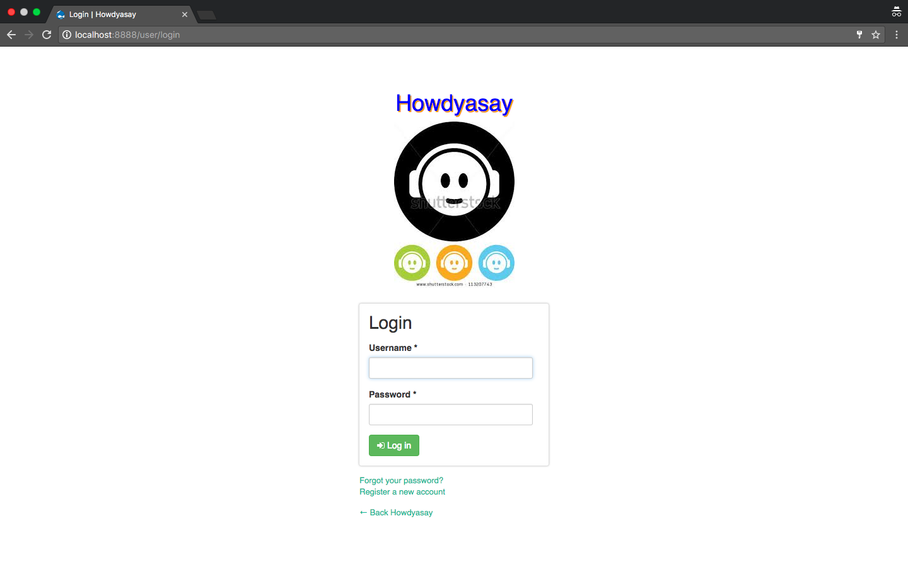
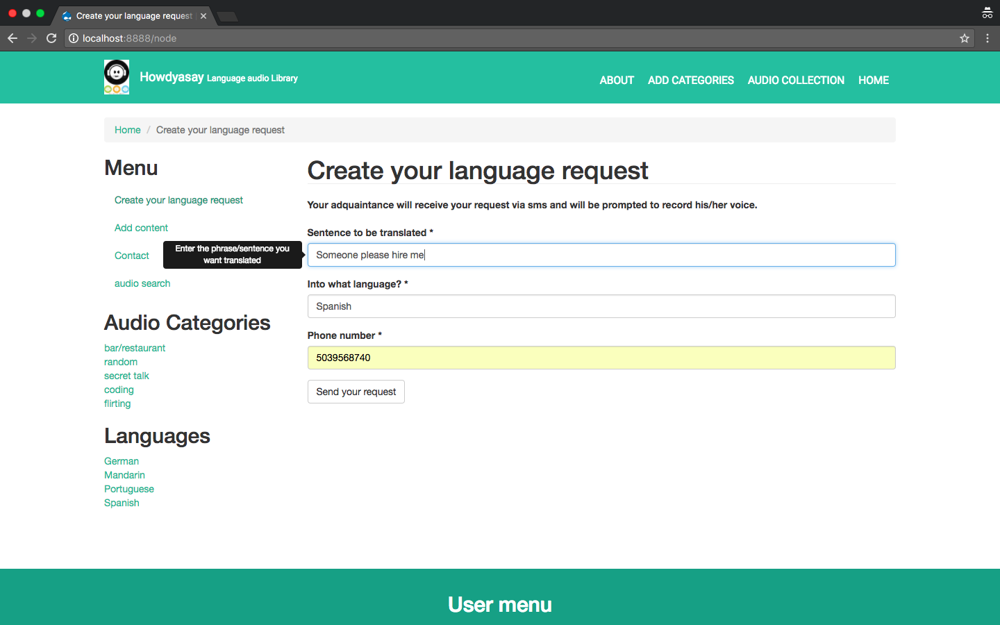
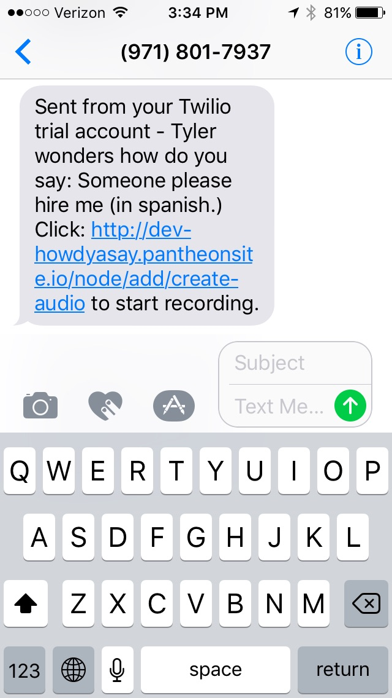
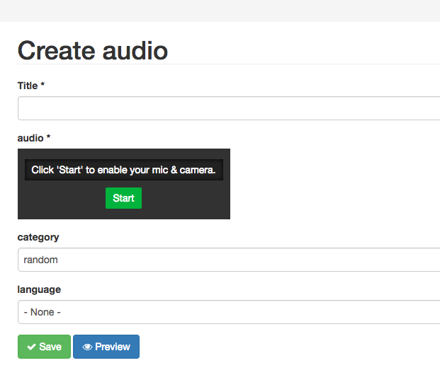
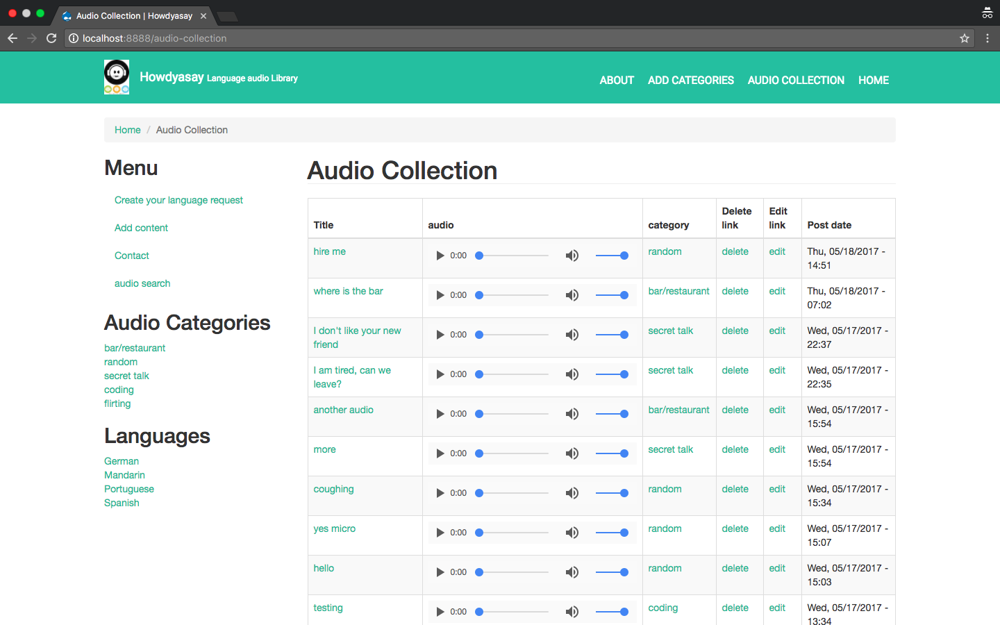
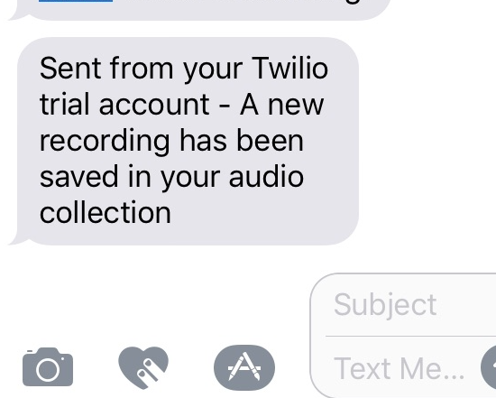
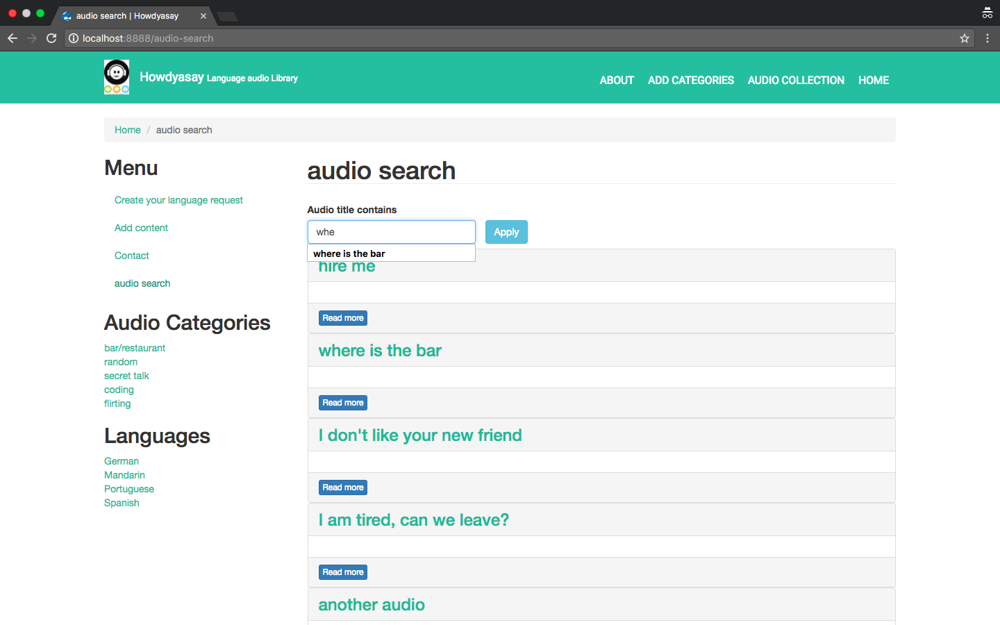

Howdyasay

#### Final Project for Epicodus, 5.18.2017

#### By Stella Huayhuaca

## Description
* This is an auditory language learning aid app. The user gets to customize the sentences/phrases he wants to learn in another language by sending a url request to a “teacher,” who can be a formal language teacher, friend, relative, or acquaintance who speaks the target language. The teacher then records an audio saying the phrase requested by the user and would not need an account to do so. The teacher would simply follow the url, which will take her to a page to record herself.
All the audios saved would go into the user’s app archive and would be organized by dates or categories such as, “Mother-in-law questions”, “Pick-up lines”, “curse words/expressions”. The user can review those audios at any time.
This app is intended to replace boring audio tapes or language laboratories that only focus on making you “repeat-after” popular, “well-established” vocabulary that you may never even use. This app allows you to mimic phrases that are specific to your needs and that you are motivated to learn.

## User stories
* The user logs in and sends a request to the teacher.

* Request is sent to the teacher via URL or text message.

* The teacher is directed by clicking on the URL to a page where she is prompted to record audio.

* Audio is saved and routed into the user’s account.

* The user gets notified when the teachers record the audio for him.

* The user manages the organization of the audio collection.

## Prerequisites
You will need the following things properly installed on your computer.
* [Git](https://git-scm.com/)
* [MAMP](https://www.mamp.info/en/)

## Installation
* `git clone this repository`
* `launch MAMP program`
* `set the Apache Port to 8888 (MAMP)`
* `set the MySQL Port to 8889 (MAMP)`
* `set news-aggregator folder as your Document Root (MAMP)`
* `open the phpMyAdmin and import the database backup file (news-aggregator/sites/db-backup)`
* `go to privilege and create user (see Sample Database section)`
* `after imported successfully, go to localhost:8888`
* `get API key from twilio`

## Sample Database
* Database name: howdyasay
* Database username: howdyasay
* Database password: howdyasay
* Site maintenance username: howdyasay
* Site maintenance password: howdyasay

## Technologies Used
 * Drupal core 7.5.4
 * MySQL
 * Media Library
 * Recorder.js

## License
 _Copyright (c) 2017 ** Stella Huayhuaca**_

 _Permission is hereby granted, free of charge, to any person obtaining a copy
 of this software and associated documentation files (the "Software"), to deal
 in the Software without restriction, including without limitation the rights
 to use, copy, modify, merge, publish, distribute, sublicense, and/or sell
 copies of the Software, and to permit persons to whom the Software is
 furnished to do so, subject to the following conditions:_

 _The above copyright notice and this permission notice shall be included in all
 copies or substantial portions of the Software._

 _THE SOFTWARE IS PROVIDED "AS IS", WITHOUT WARRANTY OF ANY KIND, EXPRESS OR
 IMPLIED, INCLUDING BUT NOT LIMITED TO THE WARRANTIES OF MERCHANTABILITY,
 FITNESS FOR A PARTICULAR PURPOSE AND NONINFRINGEMENT. IN NO EVENT SHALL THE
 AUTHORS OR COPYRIGHT HOLDERS BE LIABLE FOR ANY CLAIM, DAMAGES OR OTHER
 LIABILITY, WHETHER IN AN ACTION OF CONTRACT, TORT OR OTHERWISE, ARISING FROM,
 OUT OF OR IN CONNECTION WITH THE SOFTWARE OR THE USE OR OTHER DEALINGS IN THE
 SOFTWARE._
